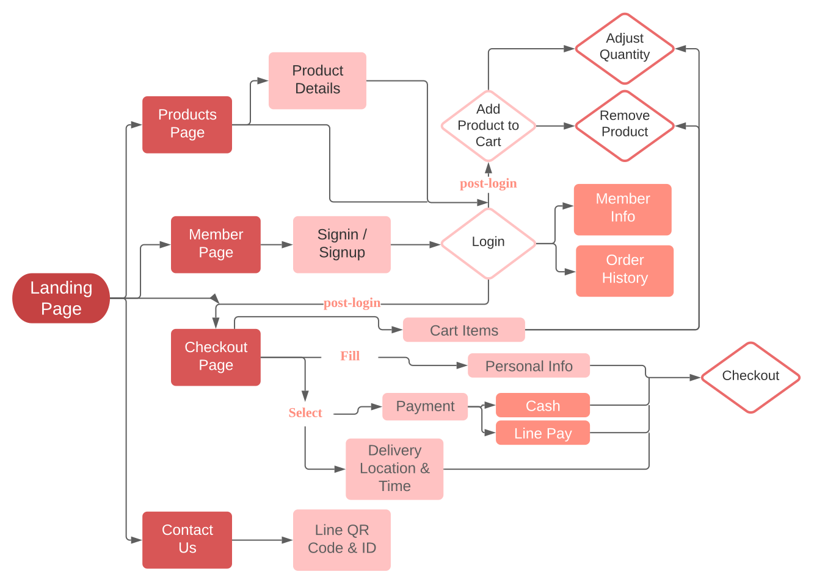
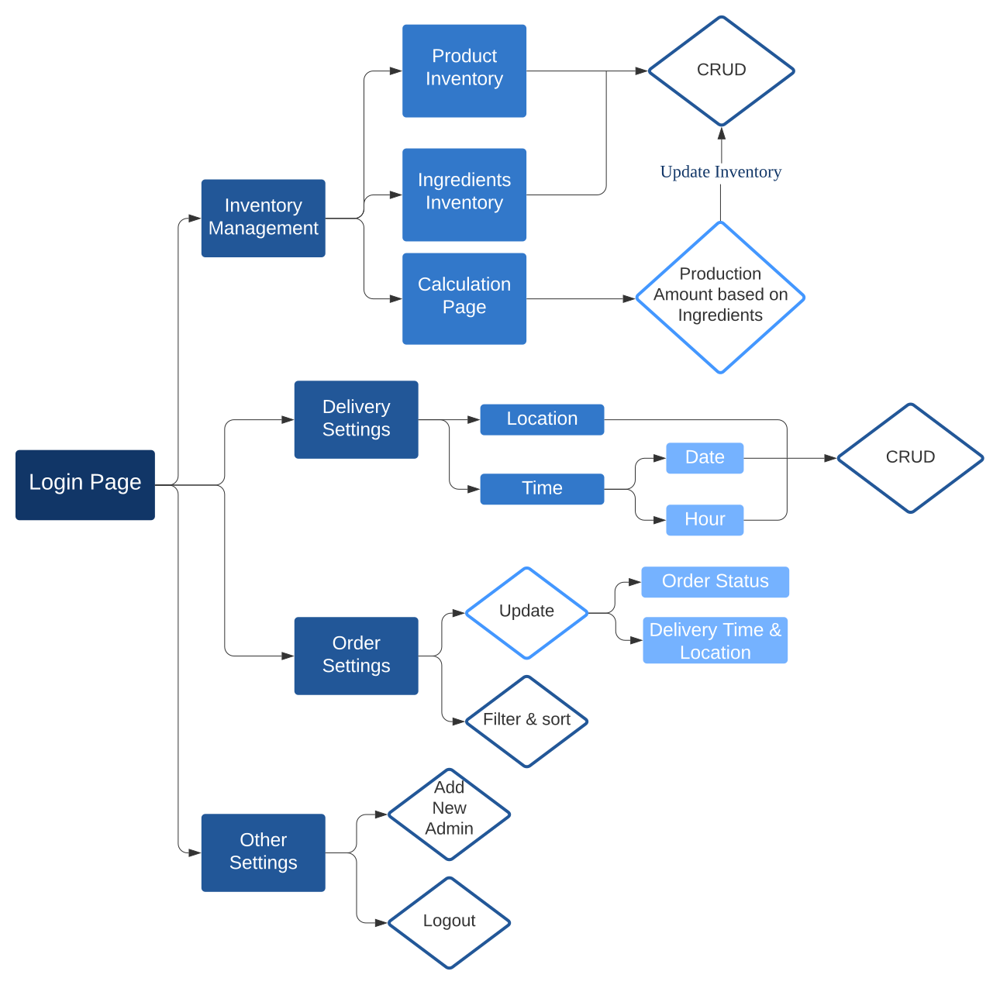

# Gua Gua Nougat 蝸蝸牛軋糖

## About

An e-commerce website that sells homemade nougats and other traditional Chinese desserts.

 (includes a backend management system)

<a href="https://gua-gua-nougat.web.app/" >View Site >></a>

## Test Accounts

### Member Login

email: test@test.com\
password: test123

### Administration Login (https://gua-gua-nougat.web.app/admin)

username: test\
password: test123

## Technologies

### Front-End

- JavaScript (ES6)
- HTML
- CSS (Flexbox & Grid)
- RWD

### Back-End

- Node.js

### Frameworks

- React (Hooks / Router)
- Redux

### JavaScript Libraries

- crypto-js
- date-fns
- axios

### Firebase

- Firestore
- Authentication
- Functions
- Cloud Storage
- Hosting

### Packages

- Map: react-google-maps/api, react-geocode, react-places-autocomplete
- Calendar: react-calendar, react-datepicker
- cors
- react-uuid
- react-beautiful-dnd
- gsap version 3 (GreenSock)

### UI Frameworks / Libraries

- styled-components
- Material UI
- Bootstrap
- Semantic UI
- SweetAlert2
- Icons: styled icons, react-useanimations

### Other Third-Party APIs

- Line Pay API

## Flow Chart

### Main Website

 

&nbsp;

### Admin System

## Features

### Main Website

- Login with social media or create own account (access control)

- Native registrations must verify email to access profile information

- Add to cart animations

- Line Pay stimulation

### Admin Page

- Manage product and ingredients inventory (CRUD)

- Rearrange product display order via drag and drop

- Calculate production amount based on ingredients and update inventory

- Add, disable, and remove in-person delivery locations

- Delivery date and time settings to set range and include / exclude certain date / times

## Future Features

- Convenient store delivery option
- Coffee shop recommendation
- Cancel order option
- Line Login
- Line chatbot to send customers their order through Line
- Pagination for product re-ordering function
- Download inventory data as csv file
- Financial analysis for profitability
